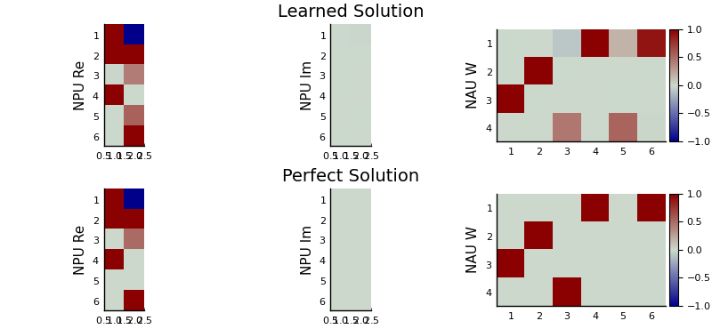

# Neural Arithmetic

[](https://travis-ci.com/nmheim/NeuralArithmetic.jl)
[](https://codecov.io/gh/nmheim/NeuralArithmetic.jl)

Collection of layers that can perform arithmetic operations such as addition,
subtraction, multiplication, and division in a single layer.  Implements
[NMU & NAU](https://openreview.net/forum?id=H1gNOeHKPS),
[NPU (ours)](https://arxiv.org/abs/2006.01681),
[NALU](https://arxiv.org/abs/1808.00508), and
[iNALU](https://arxiv.org/abs/2003.07629).
They can all be used with [`Flux.jl`](https://github.com/FluxML/Flux.jl).

Additionally there are `FastNAU` and `FastNPU` for use with [`DiffEqFlux.jl`](https://github.com/SciML/DiffEqFlux.jl).

# A Simple Example

The script [examples/npu.jl](examples/npu.jl) illustrates how to learn a the function `f`
```julia
f(x,y) = (x+y, x*y, x/y, sqrt(x))
```
with a stack of NPU and NAU.
An NPU with two inputs `x` and `y` can perform `x^a * y^b` for each hidden variable
(i.e. multiplication, division, and other power functions of its inputs).
The NAU is just a matmul, so it can perform `a*x + b*y` (i.e. addition/subtraction).

The image below depicts the learned weights of the model compared to the perfect solution.
The first plot shows the real weights of the NPU, where the first
row forms the first hidden activation `h1 = x^1*y^(-1) = x/y`, the second row
forms the second hidden activation `h2 = x^1*y^1 = x*y`, and the sqaure root is computed in
rows 3 and 4 (which can be pruned with a more effective regularisation).
The imaginary weights of the NPU are not needed in this application, so they
are all zero.
The NAU performs the remaining addition in the first row of the plot on the right.




# Comparing Neural Arithmetic Units

The figure below compares the extrapolation performance of the existing Neural Arithmetic Units
on the same task as above. Bright colors indicate low error.
All units were trained on the input range U(0.1,2). For more
details take a look at [our paper](https://arxiv.org/abs/2006.01681) and
the [code to reproduce](https://github.com/nmheim/NeuralPowerUnits) the image below.


